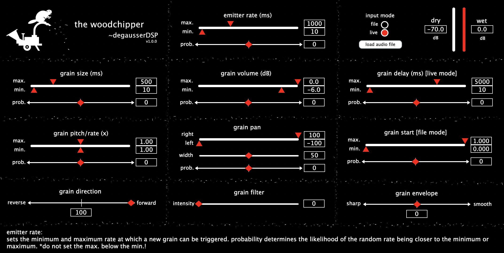

# the-woodchipper

the woodchipper by ~degausserDSP is an audio plugin for real-time granular processing. the woodchipper generates grains from an incoming signal, like your track's audio in a DAW, or from a user-loaded audio file within the plugin itself. with randomizable parameters for the rate of grain emission and each grain's volume/duration/pitch/pan/envelope/eq/direction, the sound transformation possibilities are endless. 

the woodchipper is an open-source plugin under a GPL v3.0 license, meaning you can use and modify the source code as much as you want (though it must remain open source if you are distributing it). additionally, it is free to download and use! [though, feel free to buy us a coffee :)](https://www.buymeacoffee.com/degausserDSP)

please note that this is the beta release of the plugin; we encourage you to bring up issues or provide feedback here on github or by contacting us directly, as this will help iron things out for the official alpha release!

to install, please download the applicable installer (Windows or Mac) from the Releases section and run the simple installer. the plugins should automatically download to where your computer keeps your VST3s/AUs. feel free to build the plugin yourself from the source code (instructions coming soon).
